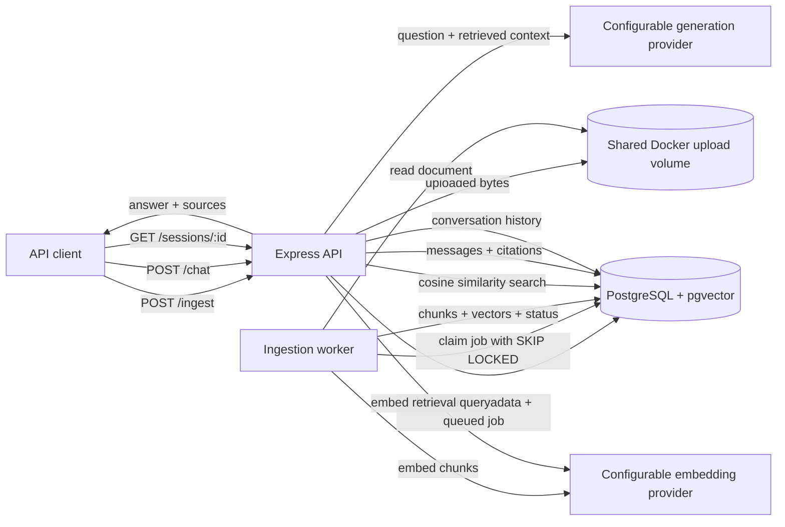
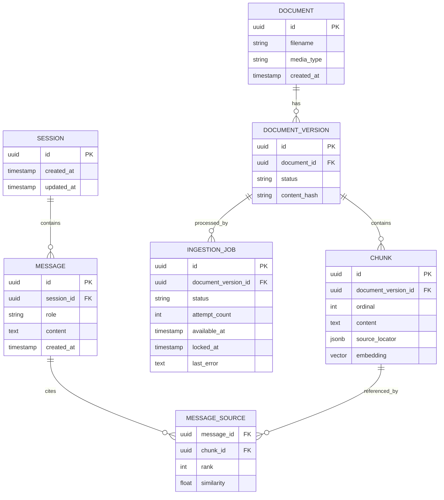

# Multi-Source Knowledge API

> Architecture and decision record - implementation has not started.

This repository will contain a conversational retrieval-augmented generation (RAG) API for ingesting PDF, DOCX, CSV, and JSON documents and answering questions with source citations and conversation context.

The current phase is intentionally limited to architecture and technical decisions. There is no runnable application, Docker environment, migration, or API implementation yet. Items marked **Open decision** require approval before implementation.

## Scope

The implementation will focus exclusively on the assignment's core requirements:

- Ingest PDF, DOCX, CSV, and JSON documents.
- Process ingestion asynchronously and expose job status.
- Parse, normalize, chunk, and embed document content.
- Store relational application data and vector embeddings.
- Perform vector-based semantic retrieval.
- Answer questions using retrieved context and return source citations.
- Track conversations by `session_id`.
- Persist user queries, generated answers, and their sources.
- Provide validation, error handling, tests, Docker setup, API documentation, and architectural documentation.

Tier 2 and Tier 3 features are deliberately out of scope. In particular, the first version will not include hybrid BM25 search, query rewriting, smart routing, SSE streaming, re-ranking, Redis caching, or a formal retrieval evaluation suite.

## Requirements Traceability

| Assignment requirement | Planned location | Status |
| --- | --- | --- |
| PDF, DOCX, CSV, and JSON ingestion | Ingestion API, approved parsers, ingestion worker | Libraries decided; implementation planned |
| Asynchronous ingestion with job status | PostgreSQL-backed job queue and `GET /jobs/{id}` | Contract decided; implementation planned |
| Chunk storage with embeddings | PostgreSQL `chunks` table with a pgvector column | PostgreSQL and pgvector decided; detailed schema open |
| Session management | `POST /chat` creates a session when `session_id` is omitted | Lifecycle decided; implementation planned |
| Chat history including sources | Chat messages and citation records | Planned; exact schema open |
| `POST /ingest` | HTTP API | Required and planned |
| `POST /chat` | HTTP API | Required and planned |
| `GET /sessions/{id}` | HTTP API | Required and planned |
| Chunking strategy and rationale | Format-aware chunking with an 800-token target and 100-token overlap | Default decided; configurable and subject to evaluation |
| Vector semantic search | pgvector HNSW cosine search, top 5 by default | Default decided; configurable and subject to evaluation |
| Source citations | Format-specific source-location metadata and chat response contract | Representation decided; detailed schema open |
| Database schema | Drizzle schema and migrations | ORM decided; detailed schema open |
| Validation and error handling | Zod at boundaries and centralized error mapping | Default decided; implementation planned |
| Docker setup | One application image, API and worker services, pgvector PostgreSQL, and a shared upload volume | Topology decided; implementation planned |
| Tests | Mirrored unit tests and Compose-based end-to-end tests using Vitest | Strategy decided; implementation planned |

## Architecture Overview

The intended architecture separates HTTP transport, application workflows, domain concepts, and infrastructure integrations. The API acknowledges ingestion quickly; a durable worker performs parsing and embedding outside the request lifecycle.



### Component Responsibilities

| Component | Responsibility |
| --- | --- |
| Express API | HTTP routing, multipart upload handling, request validation, response mapping, and error translation |
| Ingestion application service | Validate ingestion commands, create document/job records, and return an asynchronous acknowledgement |
| Ingestion worker | Claim jobs, parse files, normalize content, create chunks, request embeddings, persist indexed chunks, and manage retries/failures |
| Parser implementations | Convert each supported file format into a common normalized representation while preserving source locations |
| Chunking component | Apply an approved format-aware chunking policy and produce deterministic chunks |
| Embedding gateway | Isolate the external embedding API and support batching, timeouts, and provider error translation |
| Retrieval repository | Perform pgvector similarity search and return ranked chunks with citation metadata |
| Chat application service | Load session context, retrieve evidence, call the generation model, validate citations, and persist the interaction |
| Generation gateway | Isolate the LLM provider and enforce the answer-with-evidence prompt contract |
| PostgreSQL | Store documents, chunks, embeddings, sessions, messages, citations, and durable ingestion jobs |

The table describes intended responsibilities, not implemented modules. The initial module boundaries and mirrored test layout are recorded below and may be refined only where implementation evidence justifies it.

## Core Workflows

### Asynchronous Ingestion

1. The client uploads a supported document to `POST /ingest`.
2. The API validates the request and persists the uploaded file using the approved storage strategy.
3. In a short database transaction, the API creates a document record and a queued ingestion-job record.
4. The API returns `202 Accepted` with stable document and job identifiers.
5. A worker claims an eligible job using a short PostgreSQL transaction and `FOR UPDATE SKIP LOCKED`.
6. Outside the claim transaction, the worker parses and normalizes the document, creates chunks, and requests embeddings in batches.
7. In a completion transaction, the worker inserts the chunks and embeddings and marks the document `ready` and the job `completed`.
8. If processing fails, the worker records a sanitized error and either schedules a retry or marks the job `failed`, according to the retry policy.

External parsing and embedding calls must not occur inside a long-running database transaction. Stable identifiers and idempotent inserts/upserts will allow a retried job to converge without duplicating chunks.

The worker will run as a separate Docker Compose service using the same application image as the API. Initial operational defaults are a short polling interval, three attempts with exponential backoff, and a recoverable processing lease. Exact timing values will be environment-configurable and may change during implementation testing.

### Conversational Retrieval

1. The client submits a question and an optional `session_id` to `POST /chat`.
2. The chat service creates a session when `session_id` is omitted, or loads the existing session when it is supplied.
3. The retrieval query is embedded using the same embedding model and version used for document chunks.
4. The retrieval repository searches the shared corpus of all `ready` document versions and returns the five nearest chunks by default.
5. The generation model receives the question, selected conversation context, and retrieved chunks.
6. The service produces an answer whose citations refer only to retrieved chunks.
7. The user message, assistant answer, and source references are persisted before the response is returned.

The first version will perform a single vector retrieval step. Follow-up rewriting, hybrid search, re-ranking, and streaming are excluded because they belong to the optional tiers.

### Conversation History

`GET /sessions/{id}` will return the complete ordered conversation history, including user messages, assistant responses, and the sources associated with each response. Pagination is intentionally omitted from the assignment version to keep the API small. An unknown session returns `404 Not Found`.

## Planned API Surface

The API intentionally contains only the endpoints needed by the core assignment. Detailed request and response fields will be documented alongside implementation.

| Method and path | Purpose | Expected success status | Decision state |
| --- | --- | --- | --- |
| `POST /ingest` | Upload one document and enqueue processing | `202 Accepted` | Decided |
| `GET /jobs/{id}` | Retrieve ingestion progress and sanitized failure information | `200 OK` | Decided; necessary to expose required job status |
| `POST /chat` | Ask a question across all ready documents; create a session if `session_id` is omitted | `200 OK` | Decided |
| `GET /sessions/{id}` | Retrieve the complete ordered history and citations | `200 OK` | Decided |

Planned common error categories are invalid input (`400`), unsupported document type (`415`), missing resource (`404`), payload too large (`413`), dependency failure (`502`/`503`), and unexpected server failure (`500`). The exact error envelope and which dependency failures are retryable remain open.

## Conceptual Data Model

The final schema will be produced only after the remaining ownership and lifecycle decisions have been approved.



This model is a proposal, not an approved migration. The shared corpus, volume-backed original files, and format-specific source locators are decided; document versioning details, citation snapshots, status enums, constraints, indexes, and deletion behavior still require schema-level decisions.

## Technical Decisions and Trade-offs

### TypeScript and Node.js - Decided

The service will be written in TypeScript on Node.js. This matches the assignment preference and provides static checking across API contracts, application services, database schemas, and provider integrations.

The initial implementation will pin Node.js 24 LTS, use npm, use ES modules, and enable TypeScript strict mode. Exact patch versions will be locked in the Docker image and lockfile. Linting and formatting will use conventional automated defaults rather than bespoke style rules.

### Express - Decided

Express will provide the HTTP layer. It has a small conceptual footprint and keeps the exercise focused on ingestion, retrieval, persistence, and architectural boundaries. Express 5 also forwards rejected promises from asynchronous handlers to error middleware.

Compared with Fastify, Express provides less built-in schema-based validation and serialization. Compared with NestJS, it provides much less framework structure. We accept that trade-off and will make validation, application-service boundaries, dependency construction, and error mapping explicit.

### PostgreSQL Instead of SQLite - Decided

PostgreSQL replaces the initially considered SQLite design. SQLite would minimize setup, but PostgreSQL provides:

- Concurrent database access suitable for separate API and worker processes.
- Row-level locking and `SKIP LOCKED` for safe multi-worker job claiming.
- Native integration with pgvector.
- A single transactional boundary for relational data and embeddings.
- A more credible production migration path.

The cost is a required database service, health checking, credentials, migrations, and a persistent Docker volume. This is acceptable because reviewers can run the complete local environment with Docker Compose.

### pgvector Instead of Chroma or FAISS - Decided

Embeddings will be stored in PostgreSQL using pgvector. This keeps chunks, source metadata, and embeddings in one transactional data store and allows retrieval results to be filtered and joined using ordinary SQL.

Alternatives considered:

- **Chroma** is a purpose-built vector database with a TypeScript client, but it would introduce a second persistent service and a dual-write consistency problem between PostgreSQL and Chroma.
- **FAISS** provides high-performance similarity indexes, but it is a library rather than a transactional database. Metadata, persistence, synchronization, and TypeScript integration would become application responsibilities.
- **A dedicated vector service such as Qdrant** may be appropriate when vector search must scale or be operated independently, but that separation is not justified for the initial workload.

The initial implementation will use an HNSW index with cosine distance and retrieve the top five chunks. These are configurable starting values rather than quality claims. We will initially use pgvector's default HNSW tuning parameters and no hard similarity threshold; representative fixtures can later show whether recall, latency, or irrelevant low-score matches justify changes.

### Drizzle Instead of Prisma - Decided

Drizzle will provide type-safe TypeScript database access, schema definitions, and migrations. It was selected because it remains close to SQL, supports pgvector column types and indexes directly, and allows explicit control over transactional job-claiming queries.

Prisma was also considered. Its generated client and schema language are approachable, but it introduces a larger abstraction and generation step. For this service, direct visibility into PostgreSQL, pgvector, and queue-locking behavior is more valuable.

Drizzle still requires some database-specific SQL. In particular, enabling pgvector requires a custom migration, and job claiming may use an explicit locking query. This is an accepted trade-off rather than an attempt to hide PostgreSQL-specific behavior behind the ORM.

### node-postgres - Decided

Drizzle will connect to PostgreSQL through `node-postgres` (`pg`). Its explicit pool and checked-out-client APIs fit the service's need to control transaction boundaries for job claiming, chunk/vector insertion, and chat-history persistence.

`postgres.js` was also considered and offers a concise API, but using `node-postgres` keeps connection-pool and transaction ownership visible in the infrastructure layer. Code that begins a transaction must execute every statement through the same checked-out client and release that client in a `finally` block. Pool sizing, acquisition timeout, statement timeout, idle timeout, and migration startup ordering remain open configuration decisions.

### PostgreSQL-Backed Job Queue - Decided

The initial system will use an `ingestion_jobs` table rather than Redis, RabbitMQ, Kafka, or a hosted queue. Workers can claim work with `FOR UPDATE SKIP LOCKED`, and document/job state changes remain visible in the same database.

This choice minimizes infrastructure and provides durable jobs, but requires polling, retry/lease implementation, cleanup, and care to prevent queue traffic from competing with application traffic. A production system may move to a dedicated queue when throughput, delayed delivery, prioritization, or operational isolation justifies it.

The worker will run as a separate Docker Compose service using the same application image as the API. This preserves a real asynchronous process boundary while reviewers still start the entire system with one command. A dedicated broker is deliberately excluded from the assignment version.

### Configurable Format-Aware Chunking - Default Decided

The first implementation will use conservative, replaceable defaults:

- Target approximately 800 tokens with 100 tokens of overlap.
- Prefer heading, paragraph, row, and object boundaries over cutting at the exact target.
- Preserve page metadata for PDF and heading/paragraph structure for DOCX.
- Represent each CSV row with its column names; split only exceptionally large rows.
- Represent JSON objects or array elements with their JSON paths; recursively split oversized values.
- Derive deterministic chunk identity from the document version, ordinal, and normalized-content hash.

The overlap reduces the chance that an answer-bearing sentence is separated from its context. The 800-token target is small enough for precise citations while avoiding excessive embedding requests. These are sane defaults, not final retrieval tuning: size, overlap, and format-specific behavior will be configuration-backed where practical and revisited against representative fixtures.

### Configurable Embedding Provider - Default Decided

OpenAI will be the default provider, using `text-embedding-3-small` as the initial cost-conscious embedding model. Provider base URL, API key, model name, batch size, timeout, and expected dimensions will be supplied through validated environment configuration. The embedding gateway will depend on an application interface rather than the OpenAI SDK directly.

An OpenAI-compatible local endpoint may replace the hosted provider without changing application services. Embedding dimensions are nevertheless a database concern: the initial pgvector schema will use the default model's 1,536 dimensions. Switching to a local model with a different dimension requires a schema/index migration and complete document re-index; arbitrary models cannot be mixed in one index. The system will persist the embedding provider, model, and dimension with indexed document versions so incompatibility is explicit.

### Configurable Generation Provider - Default Decided

OpenAI will be the default provider, using `gpt-5.4-mini` as the initial balance of capability, latency, and cost. Provider base URL, API key, and model name will be configurable independently from embedding settings. The generation gateway will support an OpenAI-compatible local endpoint and keep provider-specific request and response formats out of the chat application service.

Local compatibility is configuration-based, not a promise that every local server implements every OpenAI feature. The core gateway will use the smallest common text-generation and embedding capabilities required by this assignment, and provider contract tests will make incompatibilities visible.

### Parser Libraries - Decided

- **PDF:** Mozilla PDF.js through `pdfjs-dist`, selected for its mature upstream project and direct page-level extraction needed for citations.
- **DOCX:** Mammoth, selected for established semantic DOCX-to-HTML/raw-text extraction. DOCX page numbers are not stable, so citations will use headings and paragraph/element positions.
- **CSV:** `csv-parse`, selected over Papa Parse for its server-side Node streaming API and strong package adoption, despite Papa Parse having more GitHub stars.
- **JSON:** the built-in `JSON.parse`, followed by application validation and traversal; an external parser is unnecessary for the assignment's non-streaming JSON scope.

Popularity was used as a signal, not the sole criterion. Maintenance activity, server-side suitability, TypeScript usability, streaming behavior, and the citation metadata we need were also considered. Exact dependency versions will be pinned when implementation begins.

### Shared Docker Volume for Documents - Decided

The API will write accepted uploads to a named Docker volume mounted into both API and worker services. PostgreSQL will store document metadata and processing state, not the original file bytes. This is simple for reviewers and avoids bloating the relational database.

The trade-off is that a Docker volume is a single-host storage mechanism. A production deployment would replace the filesystem adapter with durable object storage while keeping the ingestion application interface unchanged.

### Global Document Corpus and Minimal Session API - Decided

The assignment version has one shared knowledge corpus. Every chat searches all successfully indexed (`ready`) document versions; clients do not select documents, collections, workspaces, or tenants. This intentionally minimizes the API, but it is not an acceptable production authorization model.

There is no session-creation endpoint. `POST /chat` accepts an optional `session_id`: omitting it creates and returns a new session, while supplying it continues an existing session. This leaves the API at four endpoints including the required job-status endpoint.

### Design Patterns - Decided

The implementation will use patterns only where they clarify a real boundary:

- Repository for persistence and retrieval operations.
- Strategy for format-specific parsing and potentially chunking.
- Factory or explicit registry for selecting a parser by media type.
- Gateway/adapter for embedding and generation providers.
- Dependency injection through explicit construction rather than a container framework.

Dependencies will be passed explicitly through constructors or factory functions. A dependency-injection container and a generic base-repository hierarchy are intentionally excluded. The final documentation will retain only patterns that remain present after implementation.

## Validation and Error Handling

The intended policy is:

- Validate environment configuration at startup.
- Validate path parameters and JSON/multipart input at the HTTP boundary.
- Reject unsupported media types and files above an approved limit.
- Use application-specific error types and one centralized HTTP error mapper.
- Do not expose stack traces, provider payloads, prompts, document contents, or database details to clients.
- Distinguish permanent ingestion failures from retryable provider/network failures.
- Record enough failure context for operators while sanitizing API responses.

Zod will validate environment configuration and HTTP input. API errors will use one stable envelope containing a machine-readable `code`, safe `message`, optional validation `details`, and request identifier. The initial upload limit and dependency timeouts will be conservative, environment-configurable defaults rather than hard-coded architectural constraints.

## Testing Strategy

Vitest will be the TypeScript test runner. Unit tests must be fast, deterministic, and runnable without Docker, PostgreSQL, the filesystem, network access, or API credentials. End-to-end tests will exercise the deployed topology rather than replacing infrastructure with mocks.

### Test Layout and Naming

Unit tests live under the root `test/` directory and mirror the path under `src/` exactly. Production source files will not contain colocated test files.

```text
src/api/endpoint.ts              -> test/api/endpoint.spec.ts
src/application/chat-service.ts  -> test/application/chat-service.spec.ts
src/parsers/pdf-parser.ts        -> test/parsers/pdf-parser.spec.ts

test/e2e/                        end-to-end specifications
test/fixtures/                   small PDF, DOCX, CSV, and JSON fixtures
test/support/                    shared test builders and deterministic fakes
```

The mirrored path makes ownership obvious and allows a reviewer to move directly between a module and its unit specification. End-to-end files will use the suffix `.e2e.spec.ts` so Vitest projects can select them independently.

### Unit-Test Contract

A unit specification tests one production module. Every direct dependency that crosses that module's boundary is replaced with a mock, stub, or small in-memory fake. Examples include repositories, clocks, identifier generators, filesystem access, parser libraries, embedding/generation gateways, and loggers.

Unit tests will:

- Exercise public behavior, outputs, state transitions, and meaningful collaborator interactions.
- Inject dependencies through explicit interfaces where practical.
- Use typed `vi.fn()`/`vi.mock()` mocks and reset them between tests.
- Control time, identifiers, randomness, and provider responses when they affect behavior.
- Cover success, boundary, and failure paths that contain real branching logic.
- Avoid a database, containers, network calls, actual model APIs, and persistent files.

Pragmatism takes precedence over mock purity:

- Pure helper functions and inert value objects do not need to be mocked.
- Tests should not mock a module's private implementation or transitive dependencies.
- We will not assert every internal call or duplicate TypeScript's type checking.
- If mocking removes the behavior that matters, the scenario belongs in an integration or end-to-end test.
- Third-party parser behavior is verified with real fixtures at the end-to-end boundary; unit tests for our parser adapters focus on normalization, error translation, and source-location mapping.

### End-to-End Contract

End-to-end tests will start the same API, worker, PostgreSQL/pgvector, migrations, and shared upload volume used by the local Docker Compose setup. Tests communicate through public HTTP endpoints and observe asynchronous work by polling `GET /jobs/{id}` with a bounded timeout.

The test profile will use a deterministic OpenAI-compatible fake service for embeddings and generation. This avoids cost, credentials, rate limits, and nondeterministic model text while retaining the real provider adapter and network boundary. A manually triggered OpenAI smoke test may be provided separately, but it will not be required for CI or reviewer verification.

The main end-to-end scenarios are:

1. Upload representative PDF, DOCX, CSV, and JSON files; observe `202`, a queued/running job, and eventual completion.
2. Ask a grounded question after ingestion; verify that the response contains an answer, valid chunk-backed citations, and a returned `session_id`.
3. Continue the session with that identifier and retrieve the persisted ordered history with sources.
4. Reject an unsupported or malformed upload with the documented error envelope.
5. Simulate a provider/parser failure and verify retry/final failed-job behavior without exposing internal error details.

Assertions will target stable behavior and persisted relationships, not exact natural-language wording. The end-to-end environment will start from isolated database and upload volumes so runs do not depend on previous state.

### Test Commands

The intended package scripts are:

```bash
npm test                  # unit tests once; no Docker required
npm run test:watch        # unit tests in watch mode
npm run test:coverage     # unit tests with V8 coverage
npm run test:e2e          # build and run the isolated Compose test profile
npm run test:all          # unit tests followed by end-to-end tests
```

`npm test` remains the shortest and fastest developer feedback loop. Coverage is a diagnostic tool, not a target for meaningless tests; no blanket 100% threshold will be imposed. Critical orchestration, queue-state, retrieval, citation, and error-handling branches should nevertheless be covered deliberately.

## Planned Local Setup

The repository is not runnable yet. The eventual target is one command:

```bash
docker compose up --build
```

The expected local topology is:

```text
api       application image, Express entry point, shared upload volume
worker    same application image, worker entry point, shared upload volume
postgres  version-pinned pgvector PostgreSQL image, database volume
```

Compose will start the API, worker, and PostgreSQL automatically. It should include a PostgreSQL health check, separate persistent database and upload volumes, migration ordering, graceful shutdown, and restart-safe worker behavior. Image versions will be pinned rather than relying on `latest`. A local model server will be optional rather than part of the default stack, avoiding a large model download for reviewers who supply an OpenAI API key.

The end-to-end command will activate an isolated Compose test profile that adds the deterministic AI fake and test runner, waits on service health checks, and returns the test runner's exit code. Reviewers will not need to start or clean up individual services manually.

A future `.env.example` will document the database URL, upload path, independent embedding and generation base URLs/API keys/model names, embedding dimensions, server port, log level, retrieval limit, and worker polling/retry settings. Hosted OpenAI will be the documented default, while base URL and model overrides enable compatible local services.

## What Would Change in Production

### Scalability

- Run stateless API replicas separately from horizontally scaled workers.
- Move uploaded documents to durable object storage rather than container-local disk.
- Add database connection pooling and tune PostgreSQL for API, queue, and vector workloads.
- Benchmark exact search against HNSW/IVFFlat using representative corpus size, filters, latency targets, and recall measurements.
- Partition or isolate tenant data and vector indexes if tenant filtering affects recall or performance.
- Consider a dedicated queue when database polling or job volume becomes material.
- Consider a dedicated vector platform only when independent scaling or operational ownership outweighs cross-store complexity.

### Security

- Add authentication, authorization, tenant isolation, and document-level access control.
- Encrypt traffic and persistent data; use a secrets manager and short-lived credentials.
- Apply strict file-size/type checks, malware scanning, archive-bomb defenses, and parser sandboxing.
- Treat retrieved text as untrusted input and defend against prompt injection and data exfiltration.
- Apply retention/deletion policies suitable for legal documents and verify cascading deletion of embeddings, citations, and stored files.
- Maintain audit logs for document access, ingestion, retrieval, and administrative operations without logging sensitive document content.
- Review provider data-processing and retention policies before sending legal content to external models.

### Monitoring and Observability

- Emit structured logs with request, session, document, and job correlation identifiers.
- Track API latency/error rates, queue depth and job age, retries/failures, parsing and embedding duration, token consumption, retrieval latency, result scores, and model latency.
- Add distributed traces across API, worker, PostgreSQL, and model-provider calls.
- Alert on growing queue age, repeated ingestion failures, provider errors, database saturation, and abnormal token usage.
- Add readiness/liveness probes and verify migrations and pgvector availability at startup.

### Cost Optimization

- Batch embedding calls and avoid recomputing embeddings using normalized-content hashes.
- Select model sizes based on measured retrieval and answer quality rather than defaulting to the largest model.
- Bound chunk count, retrieved context, conversation history, and generated output.
- Cache immutable embeddings where it provides measurable benefit.
- Use lifecycle policies for original files and superseded document versions.
- Measure vector-index memory/storage overhead before choosing HNSW parameters or a dedicated vector service.

## Final Implementation Defaults

No unresolved architecture decision currently blocks implementation. Operational numbers remain configurable and may be adjusted when real tests provide evidence.

| Area | Final starting point |
| --- | --- |
| Runtime | Node.js 24 LTS, npm, ES modules, strict TypeScript |
| Database startup | A one-shot Compose migration service runs Drizzle migrations before API and worker services become ready |
| Connection pools | Separate API and worker pools; conservative limits and timeouts controlled through environment variables |
| Validation | Zod for environment and HTTP boundaries; centralized safe error envelope |
| Unit tests | Vitest; root `test/` mirrors `src/`; direct dependencies mocked; no Docker or external I/O |
| End-to-end tests | Vitest runner against an isolated Docker Compose stack with real PostgreSQL/pgvector, API, worker, volumes, and deterministic fake AI service |
| Coverage | V8 coverage as a diagnostic; meaningful critical-path coverage without a blanket 100% target |
| Structure | Explicit `api`, `application`, `domain`, `infrastructure`, `parsers`, `worker`, and `config` modules; no dependency-injection framework |

These are defaults, not promises that tuning values will never change. Changes that alter API behavior, persistence compatibility, or component ownership should be recorded here as new architectural decisions.

## References

- [Assignment specification](assignment.pdf)
- [PostgreSQL documentation](https://www.postgresql.org/docs/)
- [pgvector](https://github.com/pgvector/pgvector)
- [Drizzle pgvector support](https://orm.drizzle.team/docs/extensions)
- [node-postgres](https://node-postgres.com/)
- [Express 5 documentation](https://expressjs.com/en/5x/api.html)
- [OpenAI Responses API](https://developers.openai.com/api/reference/typescript/resources/responses/methods/create)
- [OpenAI embeddings](https://developers.openai.com/api/reference/typescript/resources/embeddings/methods/create)
- [Mozilla PDF.js](https://github.com/mozilla/pdf.js)
- [Mammoth](https://github.com/mwilliamson/mammoth.js)
- [Node CSV](https://github.com/adaltas/node-csv)
- [Vitest](https://vitest.dev/)
- [Vitest mocking](https://vitest.dev/guide/mocking.html)
- [Docker Compose service health and dependency conditions](https://docs.docker.com/reference/compose-file/services/)
